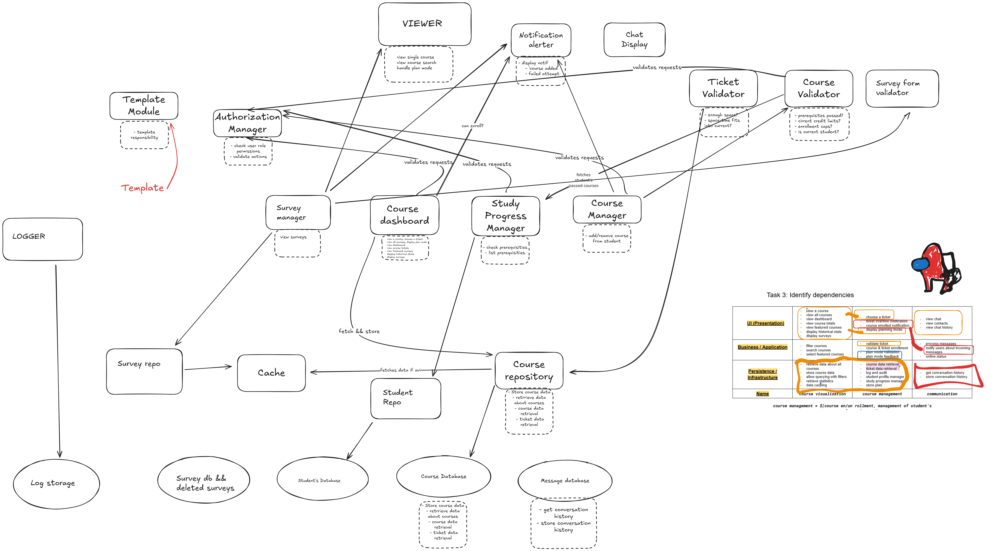

# Practicals 3: Drafting architecture based on high cohesion and low coupling

## Task 2: Architecture decomposition

| **Name** | ***Course visualization*** | ***Course management***  | ***Communication*** | **Survey management**
| :---: | ----- | ----- | ----- | ----- |
| UI (Presentation) | - view a course  - view all courses  - view dashboard  - view course totals  - view featured courses  - display historical stats  - display surveys  | choose a ticket  - ticket overflow notification  - course enrolled notification  - display planning mode | - view chat  - view contacts  - view chat history | - survey view   - survey filter handler   - survey form handler
| **Business / Application**  | - filter courses  - search courses  - select featured courses | - validate ticket  - course & ticket enrollment  - plan mode validation  - plan mode feedback | - process messages  - notify users about incoming messages  - online status | - survey-taker validation   - survey form validator   - manage survey interactions
| **Persistence / Infrastructure** | - retrieve data about all courses  - store course data  - allow querying with filters  - allow querying course details  - retrieve statistics  - data caching  - user role authorization | - course data retrieval  - ticket data retrieval  - log and audit  - student profile manager  - study progress manager  - store plan  - user role authorization | - get conversation history  - store conversation history | - survey store   - survey fetch   - survey persistence layer   - deleted surveys storage && handler  

***course management = $(course en/un rollment, management of student’s courses & requirement)***

## Task 3: Identify dependencies

## Homework

- Continue with decomposition and identifying dependencies for all core features and all their responsibilities
    - The final architecture must cover `n*(10-20)` responsibilities for `n` core features.
- Start documenting the architecture using the C4 model
    - Depending on when you have your consultation.
- For your first consultation, you must prepare the first version of your architecture.
    - It will not be perfect.
    - It will not be final.
    - We will iterate (merge, split, reorganize, reconnect, ...)
